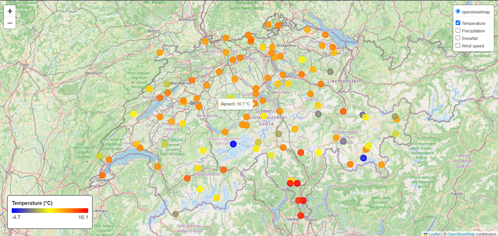

# Weather, Air Quality & Pollen Dashboard

An interactive dashboard that fetches real station-measured weather, air quality, and pollen data on a given day and displays them as toggleable layers on a single map.


## Data sources

All three sources are real instrument measurements from physical stations.

| Source | Provider | What it measures | Coverage | Notes |
|---|---|---|---|---|
| Weather | [Meteostat](https://dev.meteostat.net/) | Temperature, precipitation, snow, wind, pressure, sunshine | ~107 stations (CH) | No API key needed. Very recent dates (current year) may be unavailable, as Meteostat's bulk files are published with a delay. Units are not exposed programmatically by the library (v1.17.0) and are hardcoded from [dev.meteostat.net/parameters](https://dev.meteostat.net/parameters). |
| Air quality | [OpenAQ v3](https://docs.openaq.org/) | NO2, O3, PM10, PM2.5, SO2, CO | ~35–49 official reference stations (CH) | Requires a free API key (`X-API-Key` header). Only "official"/reference-monitor stations are kept (`monitor=true`), excluding low-cost sensors (identifiable by a `um003` particle-count sensor, which measures raw particle counts rather than calibrated mass concentration). Stations whose last reading is stale are not explicitly filtered in the current daily-value fetch (see Known limitations). |
| Pollen | [MeteoSwiss OpenData](https://opendatadocs.meteoswiss.ch/) (automatic SwissPollen network) | Alder, birch, hazel, beech, ash, oak, grass pollen | 15 stations (CH only) | No API key needed, but requests must include a `User-Agent` header. Daily values use the `d1` series (midnight-to-midnight average); MeteoSwiss also publishes a `d0` series (6am-to-6am), not used here. Only the current year's data (`_recent` files) is supported; older dates would require the `_historical` files. |

## Installation

```bash
python -m venv .venv
.venv\Scripts\activate    # Windows

pip install -r requirements.txt
```

Create a `.env` file at the project root with your free OpenAQ API key (get one at [explore.openaq.org/register](https://explore.openaq.org/register)):

```
API_KEY_openaq = your_key_here
```

## Usage

Edit the constants at the top of `main.py` to choose the day, country, and which sources to fetch:

```python
DAY = datetime(2026, 4, 1)
COUNTRY_ISO = "CH"
FETCH_WEATHER, FETCH_POLLUTION, FETCH_POLLEN = True, True, True
```

Then run:

```bash
python main.py
```

The dashboard is saved to `outputs/dashboard.html`. Open it in a browser; each data source is a separate toggleable layer.

## Project structure

```
meteo/
├── data/
│   ├── weather.py      # Meteostat: fetch_weather_for_day(day, country_iso="CH")
│   ├── pollution.py    # OpenAQ: fetch_air_quality_for_day(day, country_iso="CH")
│   └── pollen.py        # MeteoSwiss: fetch_pollen_for_day(day, station_codes=None)
├── viz/
│   └── dashboard.py     # build_dashboard(...) -> Folium multi-layer map
├── exploration/          # Early exploratory scripts (temperature vs. elevation regression)
├── main.py
├── requirements.txt
└── outputs/
    └── images/            # Examples added to readme.md
    └── dashboard.html
    
```

Each `fetch_*` function in `data/` returns a `(DataFrame, units)` tuple: one row per station with `name`, `latitude`, `longitude`, and one column per measured parameter, plus a dictionary mapping each parameter to its unit (e.g. `{"no2": "µg/m³"}`).

## Known limitations & possible improvements

- **No caching**: every run re-queries all three APIs. A simple disk cache (e.g. one file per `source_country_day`) would speed up repeated runs and reduce API load — this matters in particular for OpenAQ, whose free tier can suspend accounts that query too aggressively.
- **No pagination handling**: `get_all_stations` (Meteostat, OpenAQ) assumes a country has fewer stations than the API's per-request limit, which holds for Switzerland but not necessarily for larger countries.
- **OpenAQ daily values**: `fetch_air_quality_for_day` does not currently filter out stations with no recent activity. A sensor that exists but hasn't reported in years would simply return no data for the requested day and be silently skipped.
- **Pollen covers Switzerland only**: MeteoSwiss's automatic pollen network has no equivalent, freely accessible station-based source in other countries at the time of writing.
- **Single-day snapshots**: the project currently fetches one day at a time. A natural extension would be to fetch a date range and analyze trends over time, as explored for temperature vs. elevation in `exploration/`.

## Exploratory analysis

In comming
